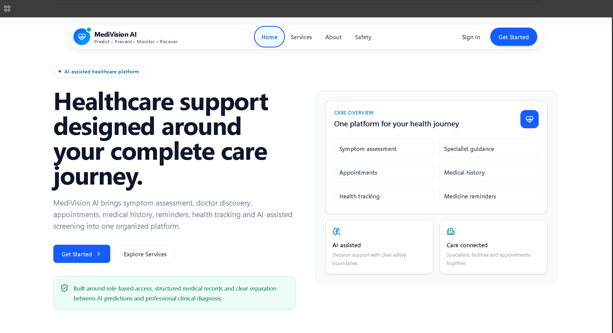
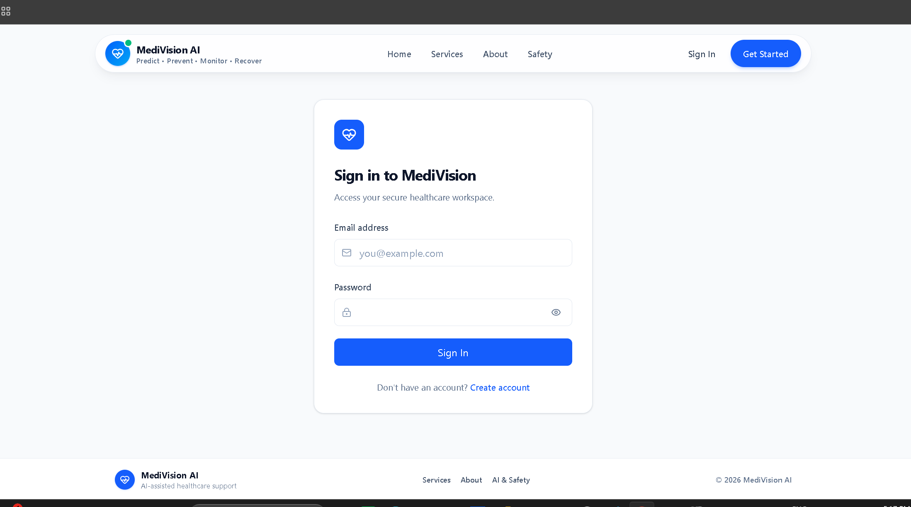
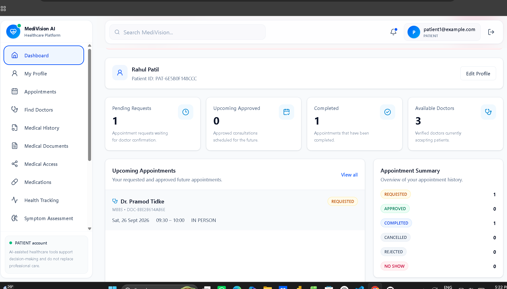
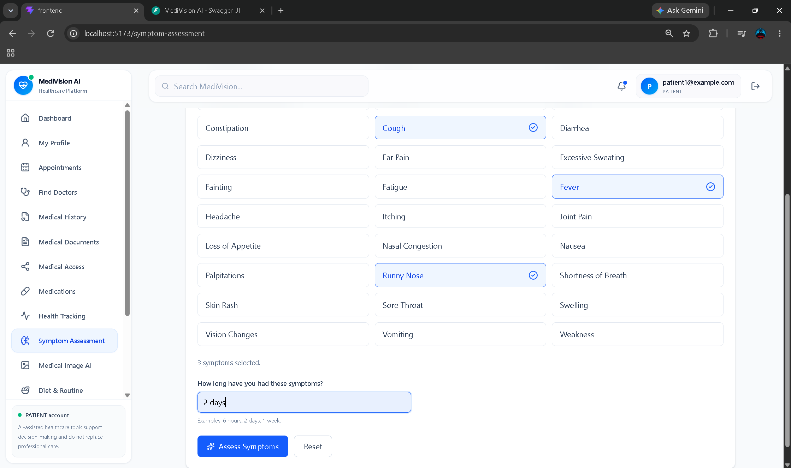
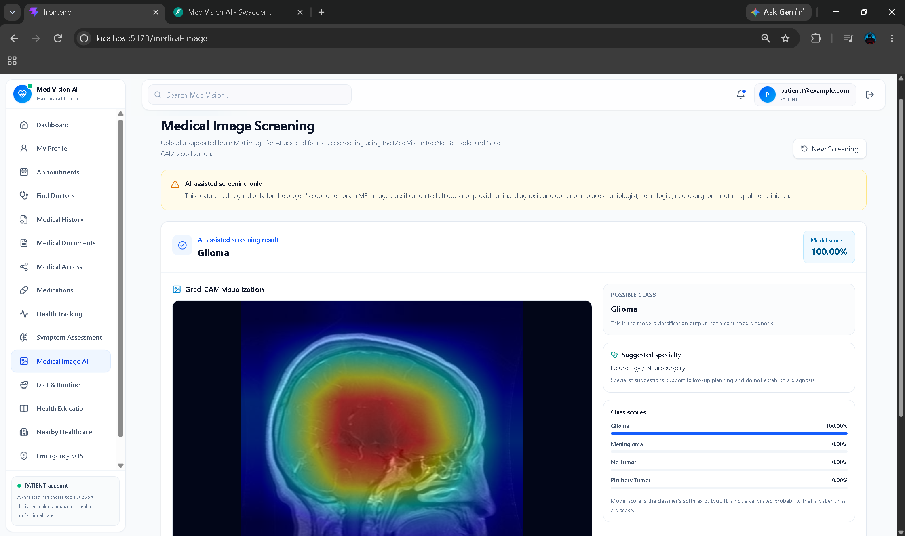
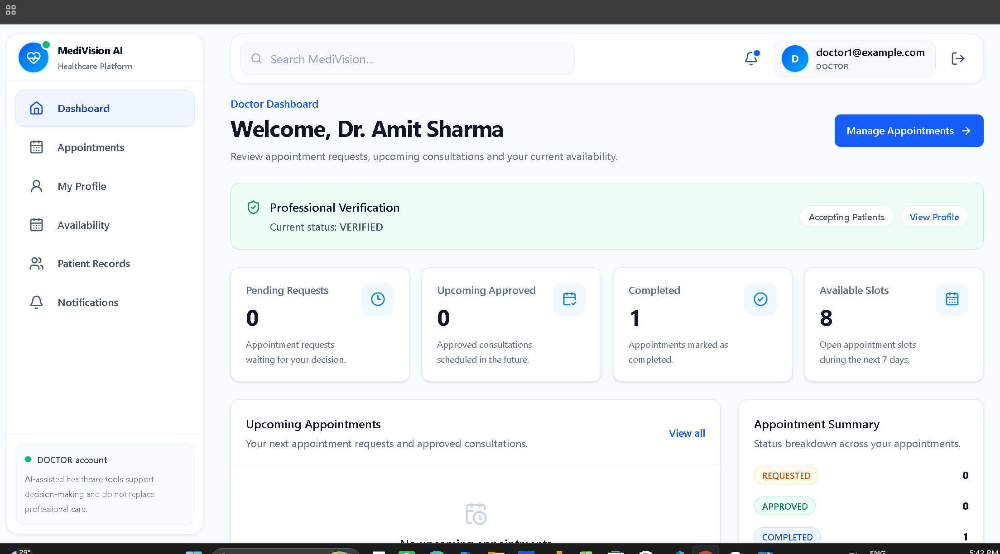
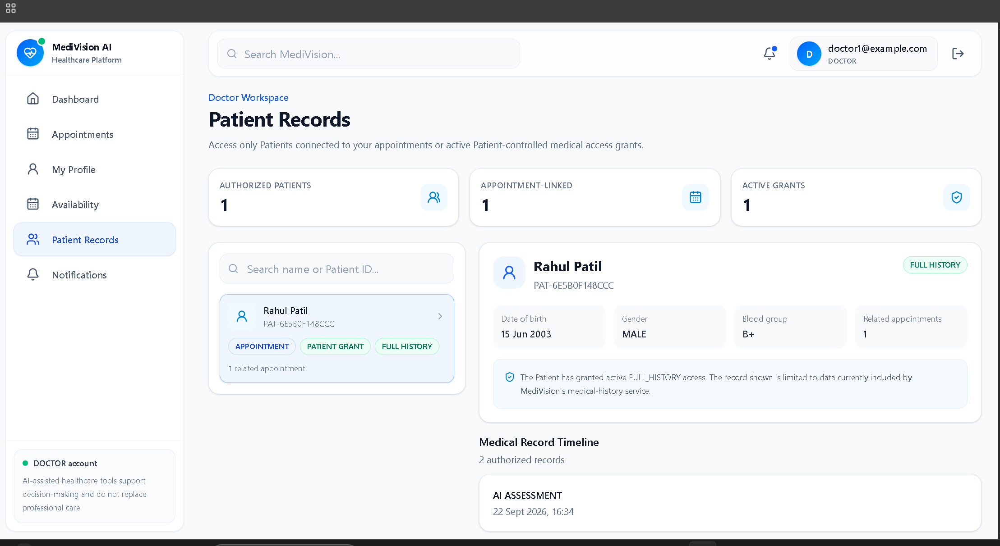
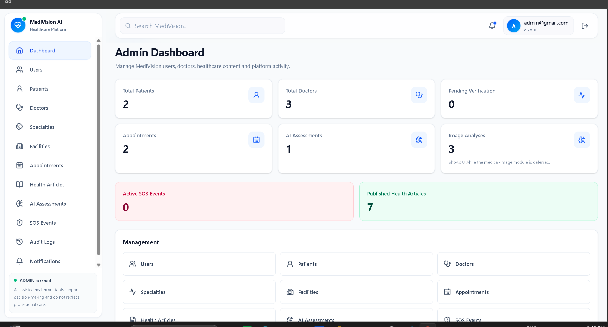
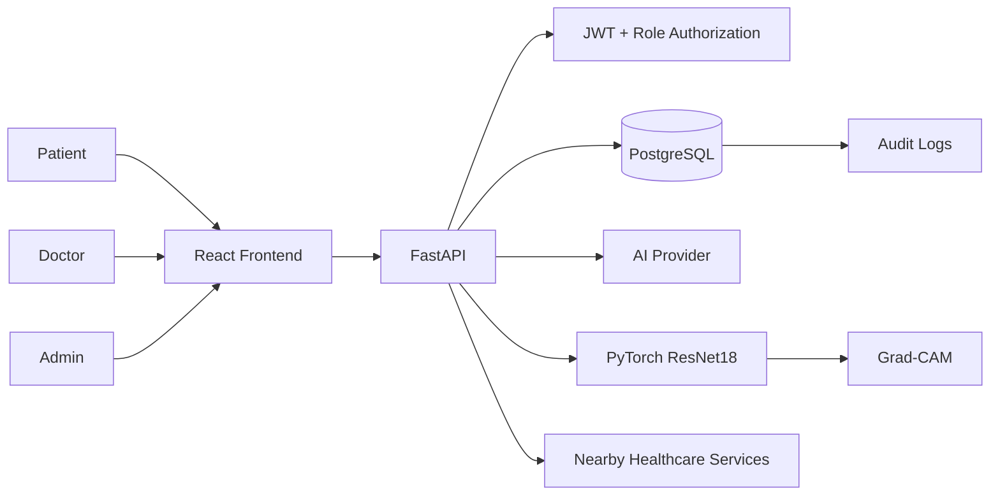

<div align="center">

# 🩺 MediVision AI

### AI-assisted Healthcare Support & Diagnostic Decision-Support Platform

**Predict • Prevent • Monitor • Recover**

**SPPU Final Year Computer Engineering Project**

</div>

---

## Overview

**MediVision AI** is a role-based healthcare web platform that combines patient services, doctor workflows, appointments, clinical records, AI-assisted symptom assessment, medical-image screening, health tracking, wellness support, nearby healthcare discovery, emergency support, notifications, administration and audit logging.

The current application supports three main roles:

```text
PATIENT
DOCTOR
ADMIN
```

> [!IMPORTANT]
> MediVision AI is an academic healthcare-support project. AI-generated outputs are intended for assistance, screening and decision support only. They must not be treated as a final medical diagnosis, autonomous prescription or replacement for a qualified healthcare professional.

---

# ✨ Key Features

| Module | Functionality |
|---|---|
| Authentication | JWT-based authentication and protected routes |
| Patient Profile | Patient demographic/profile management |
| Doctor Profile | Doctor professional profile |
| Doctor Verification | Admin-controlled professional verification |
| Doctor Availability | Availability rules, time off and appointment slots |
| Appointments | Patient booking and doctor approval/rejection workflow |
| Encounters | Doctor consultation workflow |
| Diagnoses | Encounter-linked clinical diagnoses |
| Prescriptions | Prescription and prescription-item management |
| Medical History | Digital Patient history |
| Medical Documents | Patient document upload and management |
| Medical Access | Patient-controlled Doctor access |
| Medication Management | Medications, schedules and adherence tracking |
| Health Tracking | Health metric types and measurements |
| Symptom Assessment | AI-assisted possible conditions and specialty recommendation |
| Doctor Discovery | Find Doctors and view Doctor details |
| Medical Image AI | Brain MRI classification using ResNet18 + Grad-CAM |
| Wellness | Diet and activity support |
| Health Education | Preventive-health articles |
| Nearby Healthcare | Nearby healthcare discovery |
| Emergency SOS | Emergency-support workflow |
| Notifications | Shared notification center |
| Admin Dashboard | User, Patient, Doctor and platform management |
| Audit Logs | Security and workflow audit events |
| Doctor Patient Records | Authorized Patient directory and restricted record access |

---

# 🖼️ UI Preview

> Add the PNG screenshots to `docs/ui/` using the filenames shown below.

## Public Home



## Login



## Patient Dashboard



## AI Symptom Assessment



## Medical Image Screening



## Doctor Dashboard



## Doctor Patient Records



## Admin Dashboard



For the full UI gallery, see:

[`docs/ui/README.md`](docs/ui/README.md)

---

# 🧭 Current Frontend Routes

The following routes are currently registered in `frontend/src/routes/AppRoutes.jsx`.

## Public

```text
/
/services
/about
/safety
/login
/register
```

## Shared Authenticated

```text
/dashboard
/unauthorized
/notifications
```

## Patient

```text
/appointments
/patient/profile
/sos
/patient/medications
/patient/history
/medical-history
/patient/documents
/patient/access
/health
/symptom-assessment
/medical-image
/doctors
/doctors/:doctorId
/wellness
/health-education
/health-education/:slug
/nearby
```

`/medical-history` redirects to:

```text
/patient/history
```

## Doctor

```text
/appointments
/doctor/profile
/doctor/availability
/doctor/encounters/:encounterId
/doctor/patients
```

## Admin

```text
/admin
/admin/users
/admin/patients
/admin/doctors
/admin/specialties
/admin/facilities
/admin/appointments
/admin/health-articles
/admin/ai-assessments
/admin/sos
/admin/audit
```

---

# 🧩 Backend Architecture

The current backend uses both:

```text
app/api/v1/
app/api/routes/
```

Registered router modules include:

```text
auth
health
access_test
patients
doctors
availability
discovery
recommended_doctors
appointments
encounters
diagnoses
prescriptions
medical_documents
medical_access
medication_reminders
symptom
ai
diet
activity
health_education
nearby
sos
notifications
admin
audit
medical_image
doctor_patient_records
```

Current confirmed Swagger endpoints include:

```text
GET  /api/v1/admin/audit-logs

POST /api/v1/medical-image/screen
GET  /api/v1/medical-image/analyses

GET  /api/v1/doctor/patient-records
GET  /api/v1/doctor/patient-records/{patient_id}
```

Live Swagger:

```text
http://127.0.0.1:8000/docs
```

---

# 🗄️ Current Database

The current PostgreSQL database contains **40 tables**.

Major domain groups:

```text
Identity
Doctor setup
Availability
Appointments
Clinical records
Medical documents
Medical access
Medication management
Health tracking
Diet
Activity
Health education
AI symptom assessment
Medical image analysis
Facilities
SOS
Notifications
Audit logging
```

Important current enum values include:

```text
UserRole:
PATIENT
DOCTOR
ADMIN

AppointmentStatus:
REQUESTED
APPROVED
REJECTED
CANCELLED
COMPLETED
NO_SHOW

AppointmentType:
IN_PERSON
ONLINE
PHONE

SlotStatus:
AVAILABLE
HELD
BOOKED
BLOCKED

AccessScope:
FULL_HISTORY
APPOINTMENT_ONLY
```

Detailed schema documentation:

[`docs/database/DATABASE_SCHEMA_CURRENT.md`](docs/database/DATABASE_SCHEMA_CURRENT.md)

---

# 🤖 AI Symptom Assessment

Conceptual workflow:

```text
Patient Symptoms
      ↓
Standardized Symptom Catalog
      ↓
FastAPI
      ↓
Structured AI Provider Response
      ↓
Possible Conditions
      ↓
Recommended Specialty
      ↓
Urgency + Red Flags
      ↓
Safety Message
```

Use terminology such as:

```text
AI-assisted symptom assessment
Possible conditions
Recommended specialty
Clinical decision support
```

Avoid presenting AI output as a confirmed medical diagnosis.

---

# 🧠 Brain MRI Computer Vision

The medical-image feature performs four-class Brain MRI classification.

Classes:

```text
glioma
meningioma
no_tumor
pituitary
```

UI labels:

```text
Glioma
Meningioma
No Tumor
Pituitary Tumor
```

Held-out test-set results:

| Metric | Result |
|---|---:|
| Accuracy | 94.19% |
| Macro Precision | 94.32% |
| Macro Recall | 94.10% |
| Macro F1 | 94.06% |

Per-class recall:

| Class | Recall |
|---|---:|
| Glioma | 83.42% |
| Meningioma | 94.72% |
| No Tumor | 99.75% |
| Pituitary Tumor | 98.50% |

Grad-CAM target:

```text
layer4.1.conv2
```

> [!WARNING]
> These are held-out dataset classification metrics. They must not be described as proven clinical diagnostic performance.

---

# 🖼️ Medical Image Screening Flow

Frontend:

```text
/medical-image
```

Backend:

```text
POST /api/v1/medical-image/screen
GET  /api/v1/medical-image/analyses
```

Flow:

```text
Patient Upload
      ↓
Accept Disclaimer
      ↓
FastAPI
      ↓
PyTorch ResNet18
      ↓
Possible Class
      ↓
Model Score
      ↓
Grad-CAM
      ↓
Safety Message
      ↓
Suggested Specialty
```

Correct wording:

```text
AI-assisted screening result
Possible class
Model score
Grad-CAM visualization
Suggested specialty
```

Never label the result:

```text
Final Diagnosis
```

---

# 👨‍⚕️ Doctor Patient Records

Frontend:

```text
/doctor/patients
```

Backend:

```text
GET /api/v1/doctor/patient-records
GET /api/v1/doctor/patient-records/{patient_id}
```

The Doctor must have an authorized relationship with the Patient.

Current access scopes:

```text
FULL_HISTORY
APPOINTMENT_ONLY
```

A Patient UUID by itself does not provide authorization.

---

# 🛠️ Technology Stack

## Frontend

```text
React.js
JavaScript
Vite
Tailwind CSS
shadcn/ui
TanStack Query
React Hook Form
Zod
Recharts
Axios
React Router
lucide-react
```

## Backend

```text
FastAPI
Pydantic
SQLAlchemy
Alembic
PostgreSQL
PyJWT
pwdlib / Argon2
psycopg
pytest
httpx
```

## AI / ML

```text
OpenAI API
PyTorch
torchvision
ResNet18
Grad-CAM
NumPy
Pillow
scikit-learn / XGBoost
```

---

# 🏗️ High-Level Architecture



Important domain boundaries:

```text
Appointment ≠ Encounter
AI Assessment ≠ Doctor Diagnosis
Prescription ≠ Medication Reminder
Availability ≠ Appointment
Patient UUID ≠ Authorization
Model Score ≠ Disease Probability
Grad-CAM ≠ Tumor Segmentation
```

---

# 📁 Project Structure

```text
MediVision/
│
├── .github/
│
├── backend/
│   ├── alembic/
│   ├── app/
│   │   ├── ai/
│   │   ├── api/
│   │   ├── core/
│   │   ├── dependencies/
│   │   ├── models/
│   │   ├── providers/
│   │   ├── repositories/
│   │   ├── schemas/
│   │   ├── services/
│   │   └── main.py
│   ├── scripts/
│   ├── tests/
│   ├── uploads/
│   ├── alembic.ini
│   ├── pytest.ini
│   ├── requirements-phase40.txt
│   └── requirements.txt
│
├── docs/
│   ├── api/
│   ├── database/
│   ├── diagrams/
│   ├── reports/
│   ├── research/
│   └── ui/
│
├── frontend/
│   └── src/
│       ├── api/
│       ├── assets/
│       ├── components/
│       ├── constants/
│       ├── features/
│       ├── hooks/
│       ├── lib/
│       ├── pages/
│       ├── routes/
│       ├── schemas/
│       └── utils/
│
├── ml/
│   ├── data/brain_mri/
│   ├── models/
│   ├── outputs/
│   ├── reports/
│   ├── src/
│   ├── README_PHASE37.md
│   ├── README_PHASE38.md
│   └── README_PHASE39.md
│
├── scripts/
├── tests/
├── .gitignore
└── README.md
```

---

# 🚀 Running Locally

## Backend

```powershell
cd C:\Shubham\MediVision\backend
.myenv\Scripts\Activate
fastapi dev app/main.py
```

Backend:

```text
http://127.0.0.1:8000
```

Swagger:

```text
http://127.0.0.1:8000/docs
```

## Frontend

```powershell
cd C:\Shubham\MediVision\frontend
npm run dev
```

Frontend:

```text
http://localhost:5173
```

## ML

```powershell
cd C:\Shubham\MediVision\ml
.mlenv\Scripts\Activate
```

---

# 📚 Documentation

```text
docs/
├── api/
├── database/
├── diagrams/
├── reports/
├── research/
└── ui/
```

Documentation index:

[`docs/README.md`](docs/README.md)

UI gallery:

[`docs/ui/README.md`](docs/ui/README.md)

---

# ⚠️ Medical & AI Safety

Use:

```text
AI-assisted symptom assessment
Possible conditions
Medical-image screening/classification
Clinical decision support
Model score
Grad-CAM model visualization
```

Avoid:

```text
Final Diagnosis
Guaranteed diagnosis
AI doctor
Autonomous prescription
100% disease probability
Grad-CAM proves tumor location
```

---

# 🎓 Academic Information

| Item | Details |
|---|---|
| Project | MediVision AI |
| Type | Final Year Engineering Project |
| Degree | Bachelor of Engineering — Computer Engineering |
| University | Savitribai Phule Pune University |
| Domain | Healthcare + Full Stack + AI/ML + Computer Vision |

---

# Repository

```text
https://github.com/Shubham-tidke2005/MediVision
```
