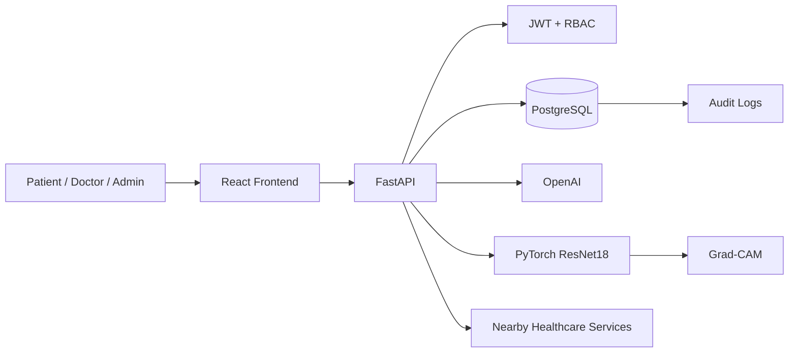

<div align="center">

# 🩺 MediVision AI

### AI-assisted Healthcare Assistance & Diagnostic Support Platform

**Predict • Prevent • Monitor • Recover**

**SPPU Final Year Computer Engineering Project**

</div>

---

## Overview

**MediVision AI** is a full-stack healthcare assistance platform that connects patient services, doctor workflows, AI-assisted symptom assessment, medical records, health tracking, wellness support, nearby healthcare, emergency support, administration, audit logging, and limited medical-image screening.

Roles:

```text
PATIENT
DOCTOR
ADMIN
```

> [!IMPORTANT]
> MediVision AI is a decision-support and academic platform. It does not provide a final medical diagnosis, autonomous prescription, or replacement for qualified healthcare professionals.

---

## Main Features

| Module | Functionality |
|---|---|
| Authentication | JWT authentication and role-based access |
| Patient Management | Patient profile and patient-owned services |
| Doctor Management | Professional profile and verification workflow |
| Availability | Doctor rules, time off and slots |
| Appointments | Request, approve, reject, cancel and complete |
| Encounters | Clinical consultation workflow |
| Diagnoses | Encounter-linked diagnoses |
| Prescriptions | Prescription and medicine-item records |
| Medical History | Patient timeline and doctor-limited history |
| Medical Documents | Healthcare document management |
| Medical Access | Patient-controlled doctor sharing |
| Medication Reminders | Schedules and adherence support |
| Health Tracking | Patient health measurements |
| Symptom Assessment | AI-assisted possible conditions, urgency and specialty |
| Doctor Recommendation | Recommended specialty connected to real doctors |
| Medical Image AI | Brain MRI ResNet18 classification + Grad-CAM |
| Diet & Routine | Wellness-oriented diet/routine suggestions |
| Activity | Activity plans and progress logs |
| Health Education | Preventive-health articles |
| Nearby Healthcare | Location/map-based healthcare discovery |
| Emergency SOS | Emergency-support workflow |
| Notifications | In-app notification center |
| Admin | Users, doctors, patients, specialties, facilities, appointments, articles, AI and SOS |
| Audit Logging | Important security/workflow events |
| Doctor Patient Records | Authorized patient directory and record access |

---

## Core Workflows

### Patient

```text
Login
 ↓
Profile
 ↓
Symptom Assessment
 ↓
Specialty Recommendation
 ↓
Find Doctor
 ↓
Book Appointment
 ↓
Doctor Approval
 ↓
Consultation
 ↓
Diagnosis + Prescription
 ↓
Medical History
```

### Medical Image

```text
Upload Brain MRI
 ↓
Accept Disclaimer
 ↓
FastAPI
 ↓
ResNet18
 ↓
Possible Class + Model Score
 ↓
Grad-CAM
 ↓
Safety Message + Suggested Specialty
```

### Doctor

```text
Login
 ↓
Appointments
 ↓
Availability
 ↓
Authorized Patient Records
 ↓
Encounter
 ↓
Diagnosis
 ↓
Prescription
```

### Admin

```text
Dashboard
 ↓
Users / Patients / Doctors
 ↓
Verification / Specialties / Facilities
 ↓
Appointments / Health Articles
 ↓
AI Assessments / SOS
 ↓
Audit Logs
```

---

## Technology Stack

### Frontend

- React.js
- JavaScript
- Vite
- Tailwind CSS v4
- shadcn/ui
- TanStack Query
- React Hook Form
- Zod
- Recharts
- Axios
- React Router
- lucide-react

### Backend

- FastAPI
- Pydantic
- SQLAlchemy 2.x
- Alembic
- PostgreSQL
- PyJWT
- pwdlib + Argon2
- psycopg 3
- pytest / httpx

### AI / ML

- OpenAI API
- PyTorch
- torchvision
- ResNet18
- Grad-CAM
- NumPy
- Pillow
- scikit-learn / XGBoost where appropriate

---

## High-Level Architecture



Important domain boundaries:

```text
Appointment ≠ Encounter
AI suggestion ≠ Doctor diagnosis
Prescription ≠ Medication reminder
Availability ≠ Appointment
UUID identity ≠ Authorization
Model score ≠ Disease probability
Grad-CAM ≠ Tumor segmentation
```

---

## Brain MRI Model

Classes:

```text
glioma
meningioma
no_tumor
pituitary
```

UI labels:

```text
Glioma
Meningioma
No Tumor
Pituitary Tumor
```

Held-out test-set metrics:

| Metric | Result |
|---|---:|
| Accuracy | 94.19% |
| Macro Precision | 94.32% |
| Macro Recall | 94.10% |
| Macro F1 | 94.06% |

> [!WARNING]
> These are held-out dataset classification metrics, not proven clinical diagnostic performance.

Grad-CAM target:

```text
layer4.1.conv2
```

---

## Main Frontend Routes

### Patient

```text
/dashboard
/patient/profile
/appointments
/doctors
/patient/history
/patient/documents
/patient/access
/patient/medications
/health
/symptom-assessment
/medical-image
/wellness
/health-education
/nearby
/sos
/notifications
```

### Doctor

```text
/dashboard
/appointments
/doctor/profile
/doctor/availability
/doctor/patients
/doctor/encounters/:encounterId
/notifications
```

### Admin

```text
/admin
/admin/users
/admin/patients
/admin/doctors
/admin/specialties
/admin/facilities
/admin/appointments
/admin/health-articles
/admin/ai-assessments
/admin/sos
/admin/audit
```

---

## Project Structure

```text
MediVision/
├── backend/
│   ├── alembic/
│   └── app/
│       ├── ai/
│       ├── api/
│       ├── core/
│       ├── models/
│       ├── repositories/
│       ├── schemas/
│       ├── services/
│       └── main.py
├── frontend/
│   └── src/
│       ├── api/
│       ├── components/
│       ├── features/
│       ├── lib/
│       └── routes/
├── ml/
│   ├── data/
│   ├── models/
│   ├── outputs/
│   ├── reports/
│   └── src/
├── docs/
└── README.md
```

---

## Quick Start

Backend:

```powershell
cd C:\Shubham\MediVision\backend
.myenv\Scripts\Activate
fastapi dev app/main.py
```

Frontend:

```powershell
cd C:\Shubham\MediVision\frontend
npm run dev
```

URLs:

```text
Frontend: http://localhost:5173
Backend:  http://localhost:8000
Swagger:  http://localhost:8000/docs
```

---

## Documentation

- [`docs/ARCHITECTURE.md`](docs/ARCHITECTURE.md)
- [`docs/SETUP.md`](docs/SETUP.md)
- [`docs/DATABASE.md`](docs/DATABASE.md)
- [`docs/API.md`](docs/API.md)
- [`docs/AI_ML.md`](docs/AI_ML.md)
- [`docs/SECURITY.md`](docs/SECURITY.md)
- [`docs/PROJECT_PROGRESS.md`](docs/PROJECT_PROGRESS.md)
- [`docs/TESTING.md`](docs/TESTING.md)
- [`docs/DEMO_FLOW.md`](docs/DEMO_FLOW.md)
- [`CONTRIBUTING.md`](CONTRIBUTING.md)

---

## Medical Safety Wording

Use:

```text
AI-assisted symptom assessment
Possible conditions
Medical-image screening/classification
Clinical decision support
Model score
Grad-CAM model visualization
```

Avoid:

```text
Final Diagnosis
AI doctor
Guaranteed diagnosis
Autonomous prescription
100% disease probability
Grad-CAM proves tumor location
```

---

## Academic Information

| Item | Details |
|---|---|
| Project | MediVision AI |
| Type | Final Year Engineering Project |
| Degree | Bachelor of Engineering — Computer Engineering |
| University | Savitribai Phule Pune University (SPPU) |
| Domain | Healthcare + Full Stack + AI/ML + Computer Vision |

Repository:

```text
https://github.com/Shubham-tidke2005/MediVision
```

---

## License

Currently intended for academic and educational use.
