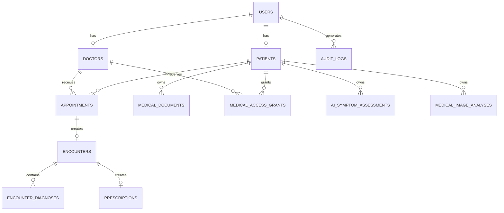

# Tables & Relationships

## Identity

```text
users
patients
doctors
```

Role:

```text
PATIENT
DOCTOR
ADMIN
```

## Doctor Verification

```text
PENDING
VERIFIED
REJECTED
SUSPENDED
```

## Appointments

Types:

```text
IN_PERSON
ONLINE
```

Statuses:

```text
PENDING
APPROVED
REJECTED
CANCELLED
COMPLETED
NO_SHOW
```

## Encounters

```text
IN_PERSON
ONLINE
EMERGENCY
FOLLOW_UP
```

## Diagnosis

```text
PRIMARY
SECONDARY
SUSPECTED
```

## Medical Access

```text
FULL_HISTORY
APPOINTMENT_ONLY
DOCUMENTS_ONLY
```

## Medication

Status:

```text
ACTIVE
COMPLETED
STOPPED
```

Adherence:

```text
TAKEN
MISSED
SKIPPED
LATE
```

## SOS

```text
TRIGGERED
ACKNOWLEDGED
RESOLVED
CANCELLED
```

## Important Relationships


