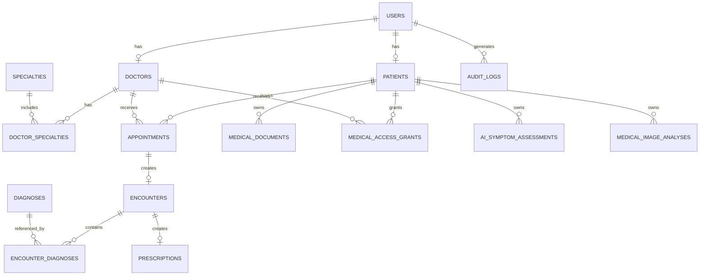

# Database ER Diagram

```mermaid
erDiagram
    USERS ||--o| PATIENTS : has
    USERS ||--o| DOCTORS : has

    DOCTORS ||--o{ DOCTOR_SPECIALTIES : has
    SPECIALTIES ||--o{ DOCTOR_SPECIALTIES : includes

    PATIENTS ||--o{ APPOINTMENTS : books
    DOCTORS ||--o{ APPOINTMENTS : receives

    APPOINTMENTS ||--o| ENCOUNTERS : creates
    ENCOUNTERS ||--o{ ENCOUNTER_DIAGNOSES : contains
    DIAGNOSES ||--o{ ENCOUNTER_DIAGNOSES : referenced_by
    ENCOUNTERS ||--o| PRESCRIPTIONS : creates

    PATIENTS ||--o{ MEDICAL_DOCUMENTS : owns

    PATIENTS ||--o{ MEDICAL_ACCESS_GRANTS : grants
    DOCTORS ||--o{ MEDICAL_ACCESS_GRANTS : receives

    PATIENTS ||--o{ AI_SYMPTOM_ASSESSMENTS : owns
    PATIENTS ||--o{ MEDICAL_IMAGE_ANALYSES : owns

    USERS ||--o{ AUDIT_LOGS : generates
```

This is a conceptual project diagram. SQLAlchemy models and Alembic migrations remain the authoritative implementation.
