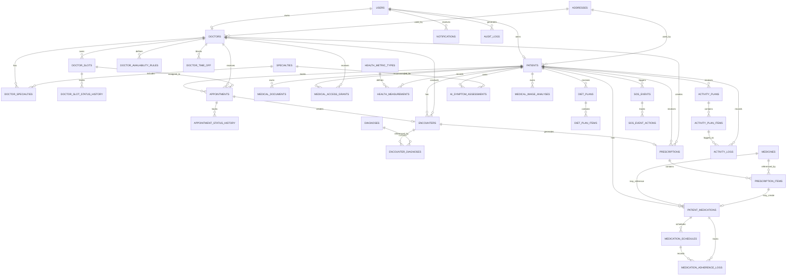

# MediVision AI — Current ER Diagram

This diagram reflects the current major relationships from the supplied SQLAlchemy models.

## Notes

`health_articles`, `healthcare_facilities`, `symptoms`, and `alembic_version` are mostly independent/master/infrastructure tables in the supplied schema.

The live SQLAlchemy models and Alembic migrations remain authoritative if this diagram ever differs from implementation.
