# Frontend Route Map

This diagram reflects the current route organization from:

```text
frontend/src/routes/AppRoutes.jsx
```

> GitHub Mermaid requires route labels containing `/`, `:` or other special characters to be wrapped in quotes.  
> For example, use `HOME["/"]` instead of `HOME[/]`.

## Application Route Map

```mermaid
flowchart TD

    APP["AppRoutes"]

    APP --> PUBLIC["Public Website"]
    APP --> AUTHAREA["Authenticated Application"]

    %% ==============================
    %% PUBLIC
    %% ==============================

    PUBLIC --> HOME["/"]
    PUBLIC --> SERVICES["/services"]
    PUBLIC --> ABOUT["/about"]
    PUBLIC --> SAFETY["/safety"]
    PUBLIC --> LOGIN["/login"]
    PUBLIC --> REGISTER["/register"]

    %% ==============================
    %% AUTHENTICATED
    %% ==============================

    AUTHAREA --> SHARED["Shared Authenticated"]
    AUTHAREA --> PATIENT["PATIENT"]
    AUTHAREA --> DOCTOR["DOCTOR"]
    AUTHAREA --> ADMIN["ADMIN"]

    %% ==============================
    %% SHARED
    %% ==============================

    SHARED --> DASHBOARD["/dashboard"]
    SHARED --> UNAUTHORIZED["/unauthorized"]
    SHARED --> NOTIFICATIONS["/notifications"]

    %% PATIENT + DOCTOR
    SHARED --> APPOINTMENTS["/appointments"]

    %% ==============================
    %% PATIENT
    %% ==============================

    PATIENT --> PATIENT_PROFILE["/patient/profile"]
    PATIENT --> SOS["/sos"]
    PATIENT --> MEDICATIONS["/patient/medications"]
    PATIENT --> HISTORY["/patient/history"]
    PATIENT --> OLD_HISTORY["/medical-history → /patient/history"]
    PATIENT --> DOCUMENTS["/patient/documents"]
    PATIENT --> ACCESS["/patient/access"]
    PATIENT --> HEALTH["/health"]
    PATIENT --> SYMPTOMS["/symptom-assessment"]
    PATIENT --> MEDICAL_IMAGE["/medical-image"]
    PATIENT --> DOCTORS["/doctors"]
    PATIENT --> DOCTOR_DETAIL["/doctors/:doctorId"]
    PATIENT --> WELLNESS["/wellness"]
    PATIENT --> HEALTH_EDUCATION["/health-education"]
    PATIENT --> HEALTH_ARTICLE["/health-education/:slug"]
    PATIENT --> NEARBY["/nearby"]

    %% ==============================
    %% DOCTOR
    %% ==============================

    DOCTOR --> DOCTOR_PROFILE["/doctor/profile"]
    DOCTOR --> AVAILABILITY["/doctor/availability"]
    DOCTOR --> ENCOUNTER["/doctor/encounters/:encounterId"]
    DOCTOR --> PATIENT_RECORDS["/doctor/patients"]

    %% ==============================
    %% ADMIN
    %% ==============================

    ADMIN --> ADMIN_DASHBOARD["/admin"]
    ADMIN --> ADMIN_USERS["/admin/users"]
    ADMIN --> ADMIN_PATIENTS["/admin/patients"]
    ADMIN --> ADMIN_DOCTORS["/admin/doctors"]
    ADMIN --> ADMIN_SPECIALTIES["/admin/specialties"]
    ADMIN --> ADMIN_FACILITIES["/admin/facilities"]
    ADMIN --> ADMIN_APPOINTMENTS["/admin/appointments"]
    ADMIN --> ADMIN_ARTICLES["/admin/health-articles"]
    ADMIN --> ADMIN_AI["/admin/ai-assessments"]
    ADMIN --> ADMIN_SOS["/admin/sos"]
    ADMIN --> ADMIN_AUDIT["/admin/audit"]
```



## Route Protection

The application currently uses:

```text
ProtectedRoute
PublicOnlyRoute
RoleRoute
```

Role constants:

```text
ROLES.PATIENT
ROLES.DOCTOR
ROLES.ADMIN
```

## Notes

- `/appointments` is available to both `PATIENT` and `DOCTOR`.
- `/notifications` is available to `PATIENT`, `DOCTOR`, and `ADMIN`.
- `/medical-history` redirects to `/patient/history`.
- `/medical-image` is an active Patient route.
- `/doctor/patients` is the Doctor Patient Records page.
- `/admin/audit` is the Admin Audit Logs page.
