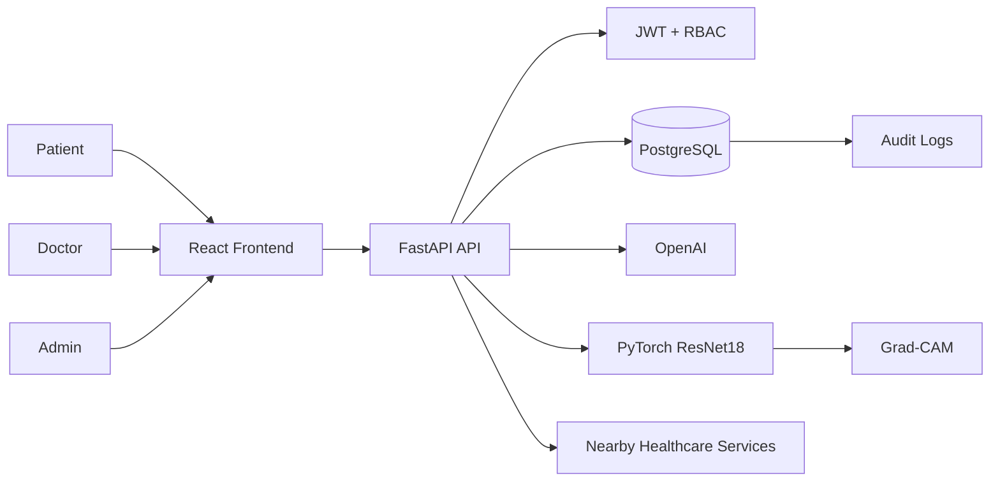

# System Architecture Diagram


```mermaid
flowchart LR
    P[Patient] --> FE[React Frontend]
    D[Doctor] --> FE
    A[Admin] --> FE

    FE --> API[FastAPI API]

    API --> AUTH[JWT + RBAC]
    API --> DB[(PostgreSQL)]
    API --> OAI[OpenAI]
    API --> CV[PyTorch ResNet18]
    API --> MAP[Nearby Healthcare Services]

    CV --> CAM[Grad-CAM]
    DB --> AUDIT[Audit Logs]
```

Backend layering:

```text
Route
 ↓
Dependency / Authorization
 ↓
Pydantic Schema
 ↓
Service
 ↓
Repository
 ↓
SQLAlchemy
 ↓
PostgreSQL
```
