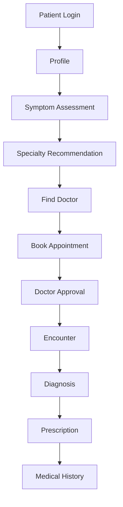
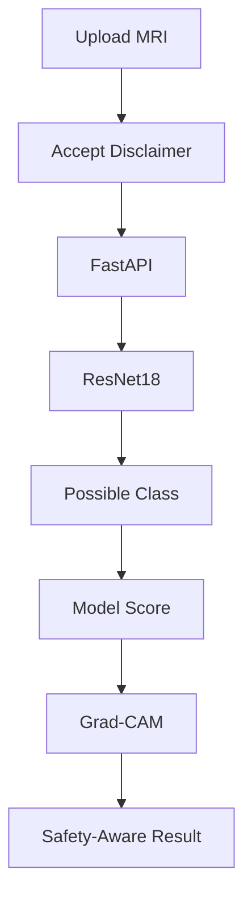
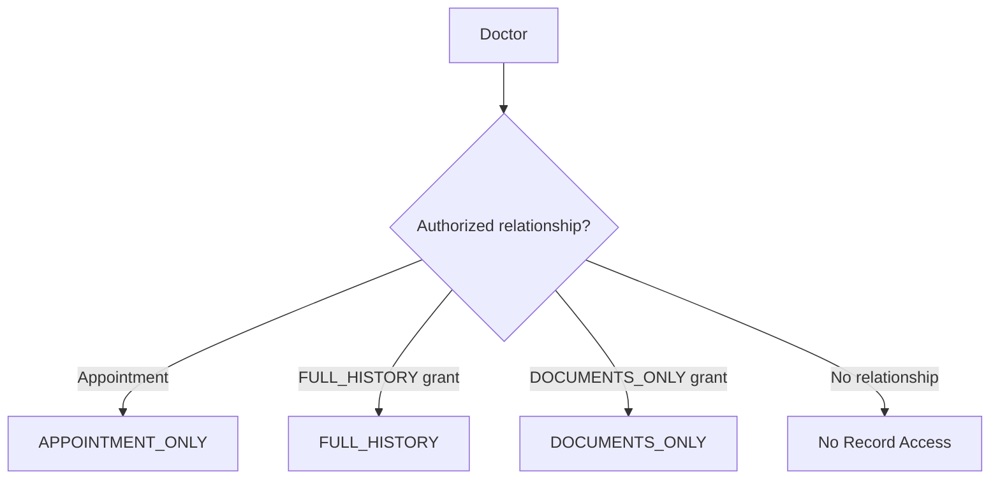
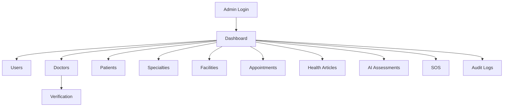

# Workflow Diagrams

## Main Patient Workflow

```mermaid
flowchart TD
    L[Patient Login] --> P[Profile]
    P --> S[Symptom Assessment]
    S --> R[Specialty Recommendation]
    R --> D[Find Doctor]
    D --> B[Book Appointment]
    B --> A[Doctor Approval]
    A --> E[Encounter]
    E --> G[Diagnosis]
    G --> PR[Prescription]
    PR --> H[Medical History]
```

## Medical Image Workflow

```mermaid
flowchart TD
    U[Upload MRI] --> C[Accept Disclaimer]
    C --> F[FastAPI]
    F --> M[ResNet18]
    M --> P[Possible Class]
    P --> S[Model Score]
    S --> G[Grad-CAM]
    G --> R[Safety-Aware Result]
```

## Doctor Record Authorization

```mermaid
flowchart TD
    D[Doctor] --> Q{Authorized relationship?}
    Q -->|Appointment| A[APPOINTMENT_ONLY]
    Q -->|FULL_HISTORY grant| F[FULL_HISTORY]
    Q -->|DOCUMENTS_ONLY grant| X[DOCUMENTS_ONLY]
    Q -->|No relationship| N[No Record Access]
```

## Admin Workflow

```mermaid
flowchart TD
    A[Admin Login] --> D[Dashboard]
    D --> U[Users]
    D --> DR[Doctors]
    DR --> V[Verification]
    D --> P[Patients]
    D --> S[Specialties]
    D --> F[Facilities]
    D --> AP[Appointments]
    D --> H[Health Articles]
    D --> AI[AI Assessments]
    D --> SOS[SOS]
    D --> AU[Audit Logs]
```
